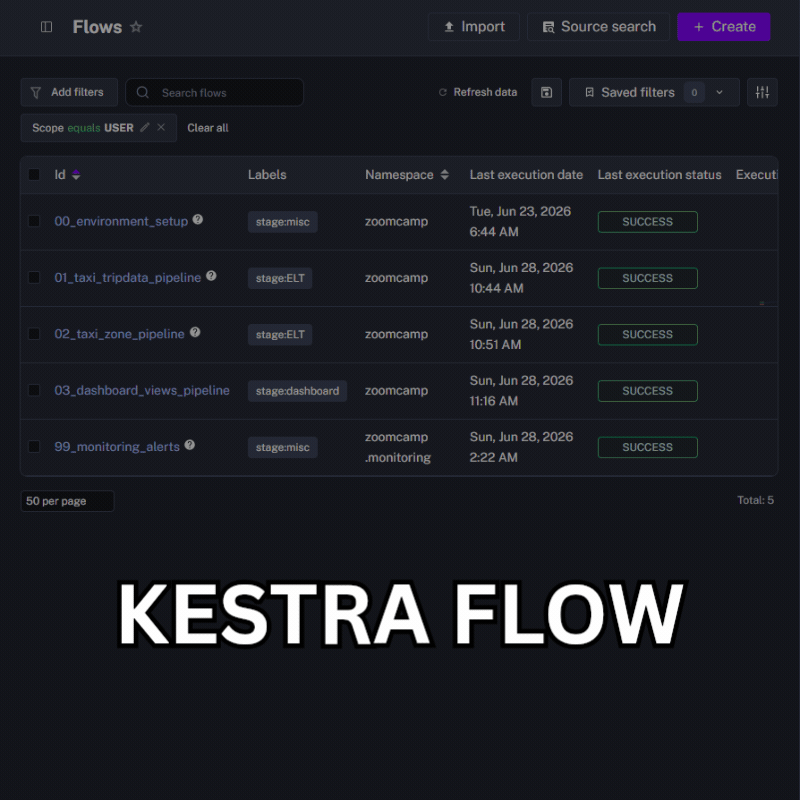
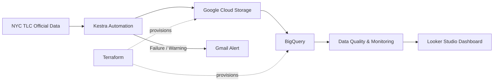

# Reliable NYC Taxi Data Platform

An automated monthly data pipeline that ingests, validates, and monitors NYC taxi data while preventing duplicate loads, handling source-schema changes, and surfacing pipeline failures.

[Live Dashboard](https://datastudio.google.com/reporting/8bfe46b6-7e23-4628-9b3f-464be80dda8c) · [Technical Documentation](TECHNICAL.md)

## Executive Summary

| | |
|---|---|
| **Problem** | Recurring public-data ingestion requires repetitive work and can fail silently, create duplicate records during reruns, or break when the source schema changes. |
| **Why It Matters** | Incomplete, duplicated, or stale data can make downstream analysis unreliable, while unnoticed failures create additional manual checking and delay data availability. |
| **Solution** | Built an automated monthly ELT platform using Kestra, GCP, BigQuery, and Terraform with idempotent loading, data-quality gates, retries, schema-evolution handling, centralized Gmail alerts, and an interactive monitoring dashboard. |

## Results

### Measured Metrics

| Metric | Result |
|---|---:|
| Files ingested in monitoring dashboard | 6 |
| Rows ingested | 11.31 million |
| Data-quality anomaly flags detected | 72,392 |
| Taxi trip datasets monitored | Yellow and Green |

### Delivered Capabilities

- Automated monthly ingestion, validation, and monitoring
- Duplicate-safe reruns using deterministic record keys and BigQuery `MERGE`
- Data-quality gates that stop empty or duplicate-key loads
- Schema-evolution handling for source changes
- Automatic retries for source downloads and GCS uploads
- Centralized Gmail alerts when Kestra executions end in `FAILED` or `WARNING`
- Interactive monitoring by filename, taxi type, load date, row volume, and anomaly category

## Live Output

  

  <a href="https://datastudio.google.com/reporting/8bfe46b6-7e23-4628-9b3f-464be80dda8c">
    Open the interactive monitoring dashboard
  </a>

The dashboard provides an operational view of the pipeline, including:

- Total files and rows ingested
- Most recent load date
- Row-volume trends by taxi type
- Data-quality anomaly totals by source file
- Detailed anomaly categories such as negative amounts, negative trip durations, and zero-fare trips
- Filters by filename, taxi type, and load date

The current monitoring snapshot contains **11.31 million rows across 6 ingested files** and surfaces **72,392 rule-based data-quality anomaly flags**. These flags identify records that warrant investigation; they do not automatically mean every flagged record is invalid.

## Architecture

The platform separates infrastructure from workflow execution: **Terraform** provisions the required GCP resources, while **Kestra** automates recurring ingestion, validation, loading, and failure handling.

## Key Engineering Decisions

- **Idempotent loading:** Deterministic record keys combined with BigQuery `MERGE` allow the same period to be rerun without inserting another copy of existing records.
- **Quality gates before loading:** The pipeline fails when staging data contains zero rows or duplicate generated keys, preventing those conditions from silently reaching the main table.
- **Centralized failure alerts:** A dedicated monitoring flow listens for failed or warning executions and automatically sends Gmail alerts instead of duplicating notification logic across every workflow.

## Technical Documentation

For detailed architecture, data flow, pipeline schedules, infrastructure, data-quality implementation, environment variables, setup, execution, and teardown instructions:

[Read the technical implementation](TECHNICAL.md)

## About Me

I am an Operations Analyst with two years of experience building Python automation, reusable data-processing pipelines, operational reports, and dashboards to improve workflows and decision-making.

I am expanding that experience into cloud data engineering, workflow orchestration, data warehousing, and analytics engineering.

[GitHub](https://github.com/MNAtthoriq) · [LinkedIn](https://linkedin.com/in/mnatthoriq)
