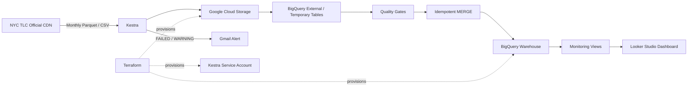

# Technical Implementation — Reliable NYC Taxi Data Platform

This document contains the implementation details for the [Reliable NYC Taxi Data Platform](README.md): architecture, orchestration, reliability controls, infrastructure, setup, and reproduction steps.

## System Architecture



## Technology Stack

| Area | Technology |
|---|---|
| Orchestration | Kestra |
| Cloud | Google Cloud Platform |
| Raw storage | Google Cloud Storage |
| Warehouse | BigQuery |
| Infrastructure as Code | Terraform |
| Local runtime | Docker Compose |
| Kestra metadata store | PostgreSQL |
| Monitoring output | Looker Studio / Google Data Studio |
| Failure notification | Gmail SMTP |
| Automation scripts | Shell |

## Data Sources

The pipeline uses NYC Taxi & Limousine Commission public data from the official TLC CDN.

- **Yellow taxi trip data:** monthly Parquet files
- **Green taxi trip data:** monthly Parquet files
- **Taxi zone lookup:** CSV dimension data

The trip pipeline calculates the source month from the scheduled execution date and downloads the corresponding TLC release directly instead of relying on a static tutorial backup.

## Pipeline Workflows

### 1. Taxi Trip Data Pipeline

`flows/main_zoomcamp.01_taxi_tripdata_pipeline.yaml`

The workflow runs separately for Yellow and Green taxi data.

1. Download the monthly Parquet file from the NYC TLC CDN.
2. Upload the source file to Google Cloud Storage.
3. Create a BigQuery external table over the Parquet file.
4. Materialize a temporary table with metadata and a deterministic `unique_row_id`.
5. Run a data-quality gate.
6. Create the partitioned destination table when it does not yet exist.
7. Apply expected schema evolution.
8. `MERGE` new records into the destination table.
9. Drop temporary and external tables.
10. Purge temporary execution files from Kestra storage.

### Schedule

The pipeline runs on the 5th of each month:

| Dataset | Schedule |
|---|---|
| Green taxi | 09:00 UTC |
| Yellow taxi | 10:00 UTC |

### 2. Taxi Zone Pipeline

`flows/main_zoomcamp.02_taxi_zone_pipeline.yaml`

The zone workflow:

1. Downloads `taxi_zone_lookup.csv` from the official TLC source.
2. Uploads it to GCS.
3. Creates an external BigQuery table.
4. Validates that the dataset is non-empty and `LocationID` is unique.
5. Rebuilds the BigQuery taxi-zone table with a `loaded_at` timestamp.
6. Removes the external table and temporary execution files.

It runs on the 5th of each month at **08:00 UTC**.

### 3. Failure Monitoring

`flows/main_zoomcamp.99_monitoring_alerts.yaml`

A centralized monitoring flow listens for executions in the `zoomcamp` namespace that end in either `FAILED` or `WARNING` status. When triggered, it sends a Gmail message containing the failed flow and execution information.

This keeps alert logic centralized instead of duplicating notification tasks across every pipeline.

### 4. Dashboard Monitoring Layer

BigQuery monitoring views feed the Looker Studio dashboard. The dashboard is designed to surface:

- Files and rows ingested
- Most recent load
- Row trends by taxi type
- Rule-based anomaly counts by source file
- Detailed anomaly categories
- Filters for filename, taxi type, and load date

## Reliability and Data-Quality Design

### Idempotent Loads

For each trip record, the pipeline creates a deterministic MD5-based `unique_row_id` from business-relevant fields. The destination table is loaded with BigQuery `MERGE`:

```sql
MERGE INTO destination T
USING staging S
ON T.unique_row_id = S.unique_row_id
WHEN NOT MATCHED THEN INSERT ROW;
```

This makes reruns and backfills duplicate-safe for records with the same generated key.

### Data-Quality Gates

Before data reaches the main table, SQL checks stop the run when:

- The temporary table contains zero rows.
- `unique_row_id` values are duplicated.

The taxi-zone pipeline applies equivalent checks for zero rows and duplicated `LocationID` values.

### Schema Evolution

The trip pipelines use:

```sql
ALTER TABLE ...
ADD COLUMN IF NOT EXISTS cbd_congestion_fee NUMERIC;
```

This allows the destination schema to absorb the `cbd_congestion_fee` field without requiring a manual migration when the source includes it.

### Retries

Network-sensitive tasks use retries:

- Source download: up to 5 attempts with a 30-second interval.
- GCS upload: up to 3 attempts with a 15-second interval.

### Cleanup

External and temporary BigQuery tables are removed after successful loading, and Kestra execution files are purged so temporary artifacts do not accumulate.

## Infrastructure

Terraform provisions the GCP resources required by the pipeline:

- Required BigQuery, Cloud Storage, and IAM APIs
- GCS bucket for raw data
- BigQuery dataset for the warehouse
- Kestra runtime service account
- Service-account key for the local Kestra runtime
- GCS object-admin access for the runtime identity
- BigQuery data-editor and job-user permissions

The raw-data bucket also uses a configurable retention lifecycle so old raw files can be deleted automatically.

## Repository Structure

```text
02-workflow-orchestration/
├── docker-compose.yml
├── .env.example
├── .env.secrets.example
├── flows/
│   ├── main_zoomcamp.00_environment_setup.yaml
│   ├── main_zoomcamp.01_taxi_tripdata_pipeline.yaml
│   ├── main_zoomcamp.02_taxi_zone_pipeline.yaml
│   └── main_zoomcamp.99_monitoring_alerts.yaml
├── scripts/
│   ├── bootstrap_env.sh
│   └── encode_secrets.sh
├── terraform/
│   ├── main.tf
│   ├── outputs.tf
│   ├── variables.tf
│   └── terraform.tfvars.example
├── proof/
│   ├── proof_export.pdf
│   └── proof.gif
├── README.md
└── TECHNICAL.md
```

Additional dashboard or monitoring-view flow files may be present in `flows/` depending on the repository revision.

## Prerequisites

- Complete the shared repository setup from the [root README](../README.md).
- Docker
- Terraform >= 1.5
- A GCP project with billing enabled
- Application Default Credentials (`gcloud auth application-default login`)
- `jq` and `curl` for the bootstrap script
- Optional Gmail account with an App Password for failure alerts

## Setup

### 1. Provision GCP Infrastructure

```bash
cd terraform
cp terraform.tfvars.example terraform.tfvars
# Fill project_id, bucket_name, dataset_id, and other required values.
terraform init
terraform apply
```

### 2. Configure Local Environment

```bash
cd ..
cp .env.example .env
cp .env.secrets.example .env.secrets
```

Fill the required Kestra, GCP, and optional Gmail values.

### 3. Encode Secrets

```bash
./scripts/encode_secrets.sh
```

The script converts values from `.env.secrets` into the encoded format used by the local Kestra setup.

### 4. Start Kestra

```bash
docker compose up -d
```

The Kestra UI is available at:

```text
http://localhost:${KESTRA_UI_PORT:-18081}
```

### 5. Bootstrap Kestra Configuration

```bash
./scripts/bootstrap_env.sh
```

This pushes Terraform outputs and environment configuration into Kestra's Key-Value Store.

## Running the Pipelines

Pipelines can be triggered manually from the Kestra UI or allowed to run on their schedules.

Scheduled order on the 5th of each month:

1. Taxi zone pipeline — 08:00 UTC
2. Green taxi trip pipeline — 09:00 UTC
3. Yellow taxi trip pipeline — 10:00 UTC

## Environment Variables

| Variable | File | Description | Sensitive |
|---|---|---|:---:|
| `KESTRA_POSTGRES_PASSWORD` | `.env` | Password for Kestra's internal PostgreSQL metadata store | Yes |
| `KESTRA_BASIC_AUTH_USERNAME` | `.env` | Username for the Kestra UI | No |
| `KESTRA_BASIC_AUTH_PASSWORD` | `.env` | Password for the Kestra UI | Yes |
| `KESTRA_UI_PORT` | `.env` | Host port for Kestra UI; default `18081` | No |
| `GCP_CREDS_BASE64` | `.env.secrets` | Encoded GCP service-account credential material | Yes |
| `GMAIL_ADDRESS` | `.env.secrets` | Sender and receiver for failure alerts | No |
| `GMAIL_APP_PASSWORD` | `.env.secrets` | Gmail App Password used for SMTP authentication | Yes |
| `project_id` | `terraform.tfvars` | GCP project ID | No |
| `region` | `terraform.tfvars` | GCP region | No |
| `bucket_name` | `terraform.tfvars` | Raw-data GCS bucket | No |
| `dataset_id` | `terraform.tfvars` | BigQuery dataset | No |
| `service_account_id` | `terraform.tfvars` | Kestra runtime service-account ID | No |
| `raw_data_retention_days` | `terraform.tfvars` | Raw-file retention period | No |

## Teardown

Stop the local orchestration environment:

```bash
docker compose down -v
```

Remove the provisioned GCP resources:

```bash
cd terraform
terraform destroy
```

## Technical Notes

### Kestra Template Syntax

Pebble expressions can be sensitive to nested expressions. Declaring intermediate variables explicitly makes flow templates easier to debug and maintain.

### Trigger and Concurrency Behavior

The taxi trip flow limits concurrency to one execution. When debugging schedules or flow triggers, verify that an existing execution is not blocking a triggered run.

## How This Extends the Zoomcamp Exercise

| Zoomcamp Exercise | This Project |
|---|---|
| Static compressed CSV backup | Monthly Parquet releases from the official NYC TLC source |
| Basic orchestration | Scheduled automation with retries, quality gates, and centralized alerts |
| No schema-evolution handling | Explicit handling for source-schema changes |
| Reruns can require manual care | Deterministic keys and `MERGE` for duplicate-safe reruns |
| Temporary objects remain | External and staging tables cleaned after loading |
| Infrastructure mixed with workflow setup | Terraform manages GCP infrastructure; Kestra manages execution |
| Manual flow and secret setup | Local scripts automate configuration bootstrap |
| No monitoring product | BigQuery monitoring layer and Looker Studio dashboard |

## References

- [Data Engineering Zoomcamp — Workflow Orchestration](https://github.com/DataTalksClub/data-engineering-zoomcamp/tree/main/02-workflow-orchestration)
- [Kestra Documentation](https://kestra.io/docs)
- [Terraform Google Provider](https://registry.terraform.io/providers/hashicorp/google/latest/docs)
- [NYC TLC Trip Record Data](https://www.nyc.gov/site/tlc/about/tlc-trip-record-data.page)
