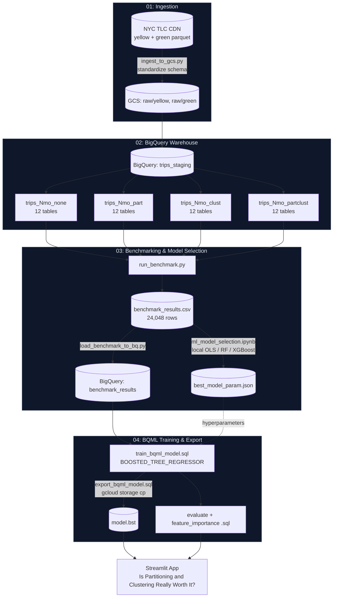
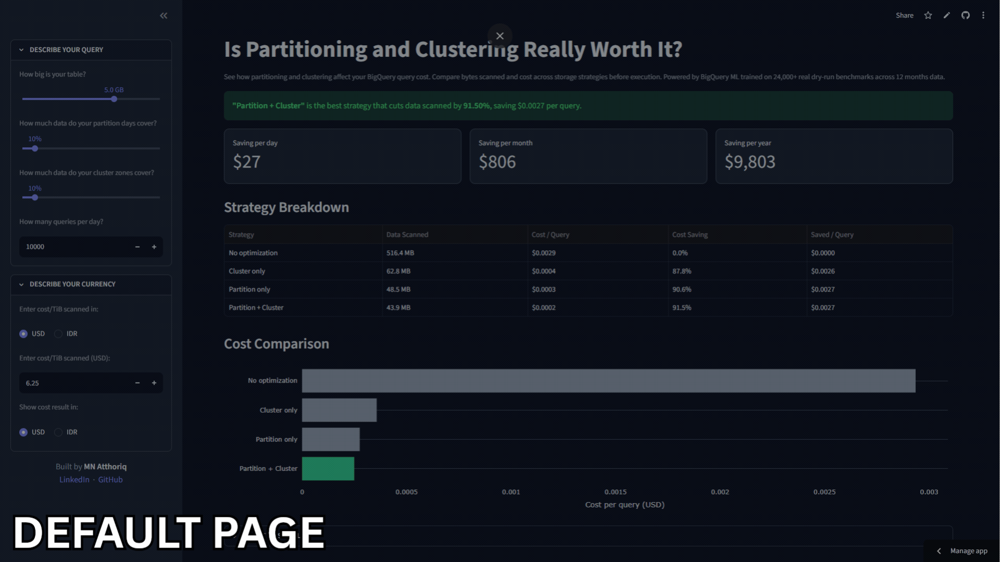

# How Much Money Do BigQuery Partitioning and Clustering Actually Save?


 


 
**🔗 Live app: [bigquery-partition-cluster-savings.streamlit.app](https://bigquery-partition-cluster-savings.streamlit.app/)**


## Overview

This project answers a concrete cost-engineering question: 
```
For a NYC taxi trips table of a given size, how much does partitioning and/or clustering actually cut BigQuery cost? Is it WORTH it?
```
By generated 24,048 BigQuery dry-run queries on 48 benchmark tables built from 12 months of NYC Taxi Trips real data. This benchmark result trained on BigQuery ML to predict query cost based on user input of storage strategy, table size, and partition/cluster selectivity.

What I improve from the [original tutorial](https://github.com/DataTalksClub/data-engineering-zoomcamp/tree/main/03-data-warehouse):
| Original tutorial | My Version |
| :--- | :--- |
| One **manual** comparison between a partitioned and non-partitioned table on a single query | **Automated** benchmark of **48 tables** and **24,048 experiments**, quantifying the impact of partitioning and clustering from **0% to 100%** selectivity |
| `linear_reg` BQML model predicting `tip_amount` (**unrelated** on BigqQuery's cost) | `BOOSTED_TREE_REGRESSOR` (XGBoost) predicting BigQuery **bytes processed** and **query cost** |
| Only **one** model trained directly in BQML **without** local comparison | **Compared** Linear Regression, Random Forest, and Gradient Boosting **locally** before training in BQML to **reduce** production cost |
| Results **only** shown in the BigQuery console | **Interactive** Streamlit cost simulator with live USD/IDR conversion |
| **No** handling of model constraints | **Redesigned** query generation and enforced **"more optimization ⇒ never more bytes scanned" **in application logic |

## Architecture


The local notebook (`ml_model_selection.ipynb`) exists specifically because BQML training have **high costs** per iteration. Model *architecture* selection (Linear Regression vs. Random Forest vs. XGBoost) is done **free** and **locally** with scikit-learn first. Only the winning hyperparameters are carried over into the actual BigQuery ML training job.

## Key Learnings 

| Concept | What I Learned |
| :---: | :--- |
| Extrapolation in Tree-based Models | Tree-based models cannot extrapolate well, so training data must cover the full range of expected inputs | 
| Monotonicity in XGBoost | BQML's `BOOSTED_TREE_REGRESSOR` doesn't expose XGBoost's native `monotone_constraints` so it had to be enforced *post-hoc* in `core.py` |
| Feature Engineering | Before adding a feature, verify it isn't already a bijection of existing ones. Example, `variant` feature was rejected since it's fully determined by `has_partition` + `has_cluster` feature |
| BigQuery ML Cost | Compare model architectures locally first and use BQML only for the final training to reduce iteration cost |

## Proof
 
<p align="center">
  
</p>

<p align="center">
  <a href="https://datastudio.google.com/reporting/8bfe46b6-7e23-4628-9b3f-464be80dda8c">
    View the interactive Streamlit dashboard here
  </a>
</p>

## Structure

```
03-data-warehouse/
├── terraform/                       ← provisions GCS bucket + BigQuery dataset
│   ├── main.tf
│   ├── outputs.tf
│   ├── variables.tf
│   └── terraform.tfvars.example
├── scripts/
│   ├── .env.example
│   ├── ingest_to_gcs.py             ← pulls NYC TLC parquet → standardizes schema → GCS
│   ├── build_table_variants.py      ← builds 4 table variants × 12 monthly tiers
│   ├── run_benchmark.py             ← dry-runs the full query matrix → benchmark_results.csv
│   ├── load_benchmark_to_bq.py      ← loads benchmark_results.csv into BigQuery
│   └── utils/
│       ├── common.py                ← shared config (tiers, variants, BQ client)
│       └── query_templates.py       ← greedy partition/cluster ratio query generator
├── sql/
│   ├── train_bqml_model.sql
│   ├── evaluate_bqml_model.sql
│   ├── feature_importance_bqml_model.sql
│   └── export_bqml_model.sql
├── notebooks/
│   └── ml_model_selection.ipynb     ← local OLS vs. Random Forest vs. XGBoost comparison
├── results/
│   ├── table_manifest.csv
│   ├── benchmark_results.csv        ← 24,048 dry-run benchmarks (generated)
│   └── best_model_param.json
├── streamlit/
│   ├── main.py                      ← frontend
│   ├── core.py                      ← prediction + cost logic
│   ├── requirements.txt             ← for hosted Streamlit app
│   └── .streamlit/config.toml
├── bqml_model/                      ← exported model.bst (gcloud storage cp target)
├── proof/                           ← gif as proof that project completed
│   └── proof.gif
└── README.md
```

## Usage
 
### Prerequisites
- Run Setup from root project [(DE Projects - Beyond Zoomcamp)](../README.md)
- Terraform >= 1.5
- A GCP project with billing enabled, and credentials available (`gcloud auth application-default login`)

### 1. Provision infrastructure
```bash
cd terraform
cp terraform.tfvars.example terraform.tfvars   # fill in project_id, bucket_name, dataset_id
terraform init
terraform apply
```
 
### 2. Configure environment
```bash
cd ../scripts
cp .env.example .env
# fill GCP_GCS_BUCKET, GCP_DATASET, GCP_PROJECT_ID from `terraform output` in ../terraform
```
 
### 3. Run the scripts
```bash
# ingest raw NYC TLC data to gcs
uv run ingest_to_gcs.py

# build 48 table variants
# writes results/table_manifest.csv
uv run build_table_variants.py

# run benchmark (dry-run queries for zero cost)
# writes results/benchmark_results.csv
uv run run_benchmark.py 

# load benchmark_result.csv to bigquery 
uv run load_benchmark_to_bq.py
```
 
### 4. Run local model selection
Open `notebooks/ml_model_selection.ipynb` tp compares Linear Regression, Random Forest, and XGBoost locally (no BQML cost), then regenerates `sql/train_bqml_model.sql` + `results/best_model_param.json` with the winning hyperparameters.
 
### 5. Train the BQML model
Run `sql/train_bqml_model.sql` in the BigQuery console.
 
### 6. Evaluate and inspect feature importance
Run `sql/evaluate_bqml_model.sql` and `sql/feature_importance_bqml_model.sql`, then update `MODEL_METRICS` / `FEATURE_IMPORTANCE` in `streamlit/core.py` with the fresh numbers.
 
### 7. Export the model
Run `sql/export_bqml_model.sql`, then follow the printed comment to copy it locally:
```bash
gcloud storage cp -r gs://<bucket>/bqml_model/xgb_bytes_predictor ./bqml_model
```
 
### 8. Run the Streamlit app locally
```bash
cd ../streamlit
uv run streamlit run main.py
```
Requires `03-data-warehouse/bqml_model/xgb_bytes_predictor/model.bst` to exist or upload a `.bst` file via the in-app uploader.
 
### Teardown
```bash
cd ../terraform
terraform destroy
```

## Environment Variables
 
| Variable | File | Description | Sensitive |
| :--- | :--- | :--- | :---: |
| `GCP_GCS_BUCKET` | `scripts/.env` | GCS bucket for raw ingested parquet, from `terraform output bucket_name` | No |
| `GCP_DATASET` | `scripts/.env` | BigQuery dataset ID, from `terraform output dataset_id` | No |
| `GCP_PROJECT_ID` | `scripts/.env` | GCP project ID, from `terraform output project_id` | No |
| `project_id` | `terraform.tfvars` | GCP project ID (must exist, billing enabled) | No |
| `region` | `terraform.tfvars` | Region for GCS bucket + BigQuery dataset (default `asia-southeast1`) | No |
| `bucket_name` | `terraform.tfvars` | Globally-unique GCS bucket name | No |
| `dataset_id` | `terraform.tfvars` | BigQuery dataset name | No |
| `raw_data_retention_days` | `terraform.tfvars` | Days to retain raw parquet in GCS before auto-delete (default `7`) | No |
 
## Author
 
**Muhammad Naufal At-Thoriq**
- GitHub: [MNAtthoriq](https://github.com/MNAtthoriq)
- LinkedIn: [Muhammad Naufal At-Thoriq](https://linkedin.com/in/mnatthoriq)

## Reference
 
- [DE Projects - Beyond Zoomcamp](../)
- [Module 3 - Data Warehouse (original tutorial)](https://github.com/DataTalksClub/data-engineering-zoomcamp/tree/main/03-data-warehouse)
- [BigQuery ML Documentation](https://cloud.google.com/bigquery-ml/docs)
- [BigQuery Partitioning & Clustering Cost Predictor — live app](https://bigquery-partition-cluster-savings.streamlit.app/)