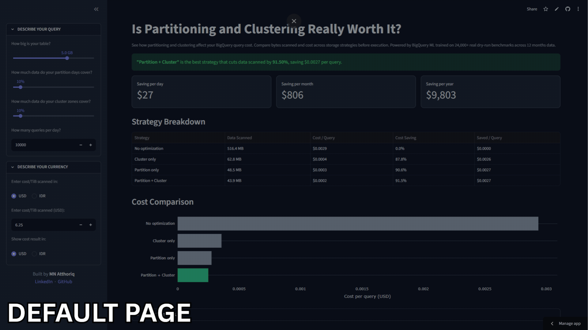

# BigQuery Cost Optimization Simulator

An interactive tool that uses real BigQuery benchmark results to compare partitioning and clustering strategies and estimate query-cost savings before execution.

[Live Simulator](https://bigquery-partition-cluster-savings.streamlit.app/) · [Technical Documentation](TECHNICAL.md)

*This project is part of [Beyond Zoomcamp: Data Engineering Portfolio](https://github.com/MNAtthoriq/de-projects-beyond-zoomcamp/blob/main/README.md)*

## Executive Summary

<table>
  <tr>
    <td width="18%"><strong>Problem</strong></td>
    <td>Partitioning and clustering can reduce BigQuery query costs, but the actual benefit depends on table size and how much data each query filters. It is difficult to know which design is worth using without testing it.</td>
  </tr>
  <tr>
    <td width="18%"><strong>Why It Matters</strong></td>
    <td>A poor table design can lead to unnecessary cloud spending or extra engineering work with little benefit. Data teams need evidence before choosing an optimization strategy.</td>
  </tr>
  <tr>
    <td width="18%"><strong>Solution</strong></td>
    <td>Built an automated benchmark across 48 BigQuery table configurations and 24,048 dry-run queries, then used the results to build an XGBoost-powered Streamlit simulator that compares query cost across four storage strategies.</td>
  </tr>
</table>

## Results

### Measured Metrics

| Metric | Result |
|---|---:|
| Benchmark Queries | 24,048 BigQuery dry-run queries |
| Table Configurations | 48 benchmark tables |
| Largest Data Tier | 48.51 million rows / 7.23 GB |
| Model Test Performance | R² 0.9998 / MAE 1.60 MB |

> Model performance is measured within the benchmarked table-size (1-7 GB) and query-pattern range.

### Key Capabilities

- **Automated cost benchmarking** — tests thousands of BigQuery query patterns without running the full queries
- **Storage strategy comparison** — compares no optimization, partitioning, clustering, and partitioning + clustering
- **Query-cost estimation** — estimates how much data each strategy will scan before execution
- **Workload-based recommendation** — uses table size and filter coverage to identify the most efficient strategy for the selected workload
- **Interactive cost simulator** — converts predicted savings into per-query, daily, monthly, and annual estimates in USD or IDR

## Live Output

  

[Open Live Simulator here](https://bigquery-partition-cluster-savings.streamlit.app/)

The simulator helps users compare BigQuery table designs before applying them.

Users can:

- Set the table size
- Describe how much data the date and location filters cover
- Compare four storage strategies
- See estimated data scanned and cost per query
- Identify the strategy with the highest estimated saving
- Estimate daily, monthly, and annual savings based on query frequency
- Display results in USD or IDR

> The simulator is designed for workloads similar to the benchmark used to train the model. It is a decision-support tool, not a universal BigQuery cost calculator.

## Architecture

```mermaid
flowchart LR
    A[NYC Taxi Data] --> B[Automated BigQuery Benchmark]
    B --> C[Benchmark Results]
    C --> D[XGBoost Prediction Model]
    D --> E[Interactive Cost Simulator]
```

In simple terms:

1. Real NYC taxi data is loaded into BigQuery using different table designs.
2. Thousands of query patterns are tested automatically.
3. The benchmark records how much data each query would scan.
4. An XGBoost model learns from those benchmark results.
5. The Streamlit simulator uses the model to compare strategies for a user-defined workload.

## Technical Documentation

For detailed explanation about how the benchmark, BigQuery tables, model, infrastructure, and Streamlit application are built and run:

[Read Technical Documentation here](TECHNICAL.md)

## About Me

**Muhammad Naufal At-Thoriq**

I am an Operations Analyst with two years of experience using data, automation, and dashboards to improve operational workflows and decision-making.

My professional work includes Python automation, reusable data-processing pipelines, operational reporting, data validation, and dashboard development.

I am expanding that experience into cloud data engineering, workflow orchestration, data warehousing, and analytics engineering.

[GitHub](https://github.com/MNAtthoriq) · [LinkedIn](https://linkedin.com/in/mnatthoriq)