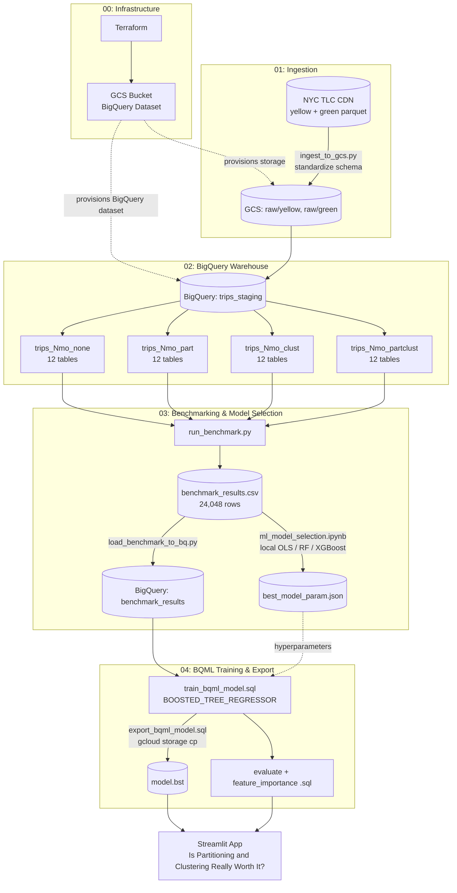

# BigQuery Cost Optimization Simulator — Technical Documentation

This document explains how the BigQuery benchmark, prediction model, and Streamlit cost simulator are built, configured, and run.

[← Back to Project README](README.md)

## Data Sources

The project uses public trip data from the
[NYC Taxi & Limousine Commission](https://www.nyc.gov/site/tlc/about/tlc-trip-record-data.page).

| Data | Format | Purpose |
|---|---|---|
| Yellow Taxi Trip Data | Parquet | Monthly Yellow Taxi transactions |
| Green Taxi Trip Data | Parquet | Monthly Green Taxi transactions |

The ingestion script downloads 12 months of Yellow and Green Taxi data, standardizes both datasets into a common schema, and uploads the files to Google Cloud Storage.

## Usage

### Prerequisites

- Python 3.12+
- [uv](https://docs.astral.sh/uv/)
- Terraform >= 1.5
- Google Cloud project with billing enabled
- Google Cloud CLI (`gcloud`)

#### Authenticate with Google Cloud

```bash
gcloud auth application-default login
```

### 1. Clone the Repository

```bash
# Clone the repo
git clone https://github.com/MNAtthoriq/de-projects-beyond-zoomcamp.git
cd de-projects-beyond-zoomcamp

# Install dependencies
uv sync --locked

# Move into this project
cd 03-data-warehouse
```

### 2. Provision Google Cloud Resources

```bash
cd terraform

cp terraform.tfvars.example terraform.tfvars
# Fill in project_id, bucket_name, dataset_id, etc.

terraform init
terraform apply
```

Terraform creates:

- Google Cloud Storage bucket
- BigQuery dataset
- Required Google Cloud APIs

### 3. Configure the Environment

```bash
cd ../scripts

cp .env.example .env
# Fill GCP_GCS_BUCKET, GCP_DATASET, and GCP_PROJECT_ID
```

### 4. Ingest NYC Taxi Data

```bash
uv run ingest_to_gcs.py
```

This downloads 12 months of Yellow and Green Taxi data, standardizes the schema, and uploads the Parquet files to Google Cloud Storage.

### 5. Build Benchmark Tables

```bash
uv run build_table_variants.py
```

This creates 48 BigQuery tables:

- 12 data-size tiers
- 4 storage strategies per tier

The generated table summary is saved to:

```text
results/table_manifest.csv
```

### 6. Run the Benchmark

```bash
uv run run_benchmark.py
```

This generates 24,048 BigQuery dry-run tests across the benchmark tables and query patterns.

The results are saved to:

```text
results/benchmark_results.csv
```

### 7. Load Benchmark Results to BigQuery

```bash
uv run load_benchmark_to_bq.py
```

This loads the benchmark dataset into BigQuery for model training.

### 8. Compare Models Locally

Open:

```text
notebooks/ml_model_selection.ipynb
```

The notebook compares Linear Regression, Random Forest, and XGBoost before the final model is trained in BigQuery ML.

The selected model settings are saved to:

```text
results/best_model_param.json
```

### 9. Train the BigQuery ML Model

Run:

```text
sql/train_bqml_model.sql
```

The final model is a BigQuery ML `BOOSTED_TREE_REGRESSOR`.

### 10. Evaluate the Model

Run:

```text
sql/evaluate_bqml_model.sql
sql/feature_importance_bqml_model.sql
```

The deployed application currently records:

| Metric | Train | Test |
|---|---:|---:|
| R² | 0.9998 | 0.9998 |
| MAE | 1.48 MB | 1.60 MB |

### 11. Export the Model

Run:

```text
sql/export_bqml_model.sql
```

Then copy the exported model from Google Cloud Storage, for example:

```bash
gcloud storage cp -r \
  gs://<bucket>/bqml_model/xgb_bytes_predictor \
  ./bqml_model
```

### 12. Run the Streamlit App

```bash
cd ../streamlit
uv run streamlit run main.py
```

The app expects the exported model at:

```text
bqml_model/xgb_bytes_predictor/model.bst
```

### Teardown

```bash
cd ../terraform
terraform destroy
```

## Repository Structure

```text
03-data-warehouse/
├── terraform/
│   ├── main.tf
│   ├── outputs.tf
│   ├── variables.tf
│   └── terraform.tfvars.example
│
├── scripts/
│   ├── .env.example
│   ├── ingest_to_gcs.py
│   ├── build_table_variants.py
│   ├── run_benchmark.py
│   ├── load_benchmark_to_bq.py
│   └── utils/
│       ├── common.py
│       └── query_templates.py
│
├── sql/
│   ├── train_bqml_model.sql
│   ├── evaluate_bqml_model.sql
│   ├── feature_importance_bqml_model.sql
│   └── export_bqml_model.sql
│
├── notebooks/
│   └── ml_model_selection.ipynb
│
├── results/
│   ├── table_manifest.csv
│   ├── benchmark_results.csv
│   └── best_model_param.json
│
├── streamlit/
│   ├── main.py
│   ├── core.py
│   ├── requirements.txt
│   └── .streamlit/
│       └── config.toml
│
├── bqml_model/
├── proof/
│   └── proof.gif
├── README.md
└── TECHNICAL.md
```

| Path | Purpose |
|---|---|
| `terraform/` | Creates the required Google Cloud resources |
| `scripts/` | Ingests data, builds benchmark tables, and runs the benchmark |
| `sql/` | Trains, evaluates, and exports the BigQuery ML model |
| `notebooks/` | Compares model options locally |
| `results/` | Stores benchmark outputs and selected model settings |
| `streamlit/` | Interactive cost simulator |
| `bqml_model/` | Exported XGBoost model used by the app |
| `proof/` | Application preview |
| `README.md` | Recruiter-facing project overview |
| `TECHNICAL.md` | Technical setup and implementation details |

## Architecture



In simple terms:

1. Terraform provisions the cloud infrastructure.
2. Python downloads and standardizes NYC Taxi data.
3. The files are stored in Google Cloud Storage.
4. BigQuery creates 48 controlled table configurations across different data sizes and storage strategies.
5. The benchmark automatically tests thousands of filter combinations using BigQuery dry runs.
6. The results are used to compare candidate models locally.
7. The selected XGBoost approach is trained with BigQuery ML.
8. The model is exported and used by the Streamlit simulator.

## Technical Notes

### How This Extends the Zoomcamp Project

| Original tutorial | My Version |
| :--- | :--- |
| One manual partitioned vs. non-partitioned comparison | Automated benchmark across 48 table configurations |
| Small number of example queries | 24,048 query tests across different table sizes and filter patterns |
| Partitioning is demonstrated as a concept | Measures when partitioning and clustering actually reduce data scanned |
| Example BQML regression model | XGBoost model predicts BigQuery bytes processed |
| One model trained directly in BigQuery ML | Linear Regression, Random Forest, and XGBoost compared locally first |
| Results shown in BigQuery | Interactive Streamlit cost simulator |
| No application-level model checks | Predictions are adjusted to avoid impossible strategy comparisons |


### Key Learnings

| Concept | What I Learned |
| :---: | :--- |
| **Controlled Benchmarking** | Table optimization should be measured across different data sizes and query patterns instead of assumed to always help. |
| **Filter Selectivity** | Partitioning and clustering become more useful when queries can avoid scanning a larger share of the table. |
| **Local Model Selection** | Comparing model options locally first reduces unnecessary BigQuery ML training iterations. |
| **Model Range** | Tree-based models work best within the range represented in the training data, so the app keeps table-size inputs close to the benchmark range. |
| **Prediction Checks** | The application adjusts model outputs so an optimized strategy is not shown as scanning more data than a less-optimized strategy. |


## About Me

I am an Operations Analyst with two years of experience using data,
automation, and dashboards to improve operational workflows and decision-making.

My professional work includes Python automation, reusable data-processing
pipelines, operational reporting, data validation, and dashboard development.

I am expanding that experience into cloud data engineering, workflow
orchestration, data warehousing, and analytics engineering.

[GitHub](https://github.com/MNAtthoriq) ·
[LinkedIn](https://linkedin.com/in/mnatthoriq)
